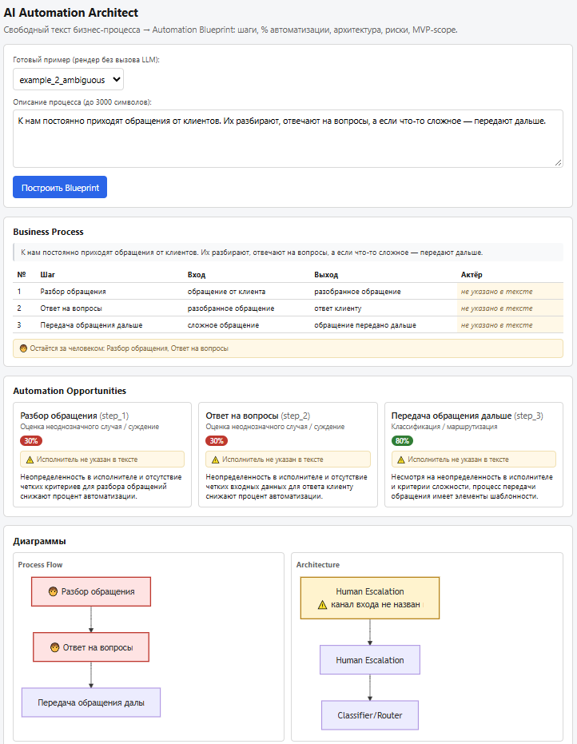
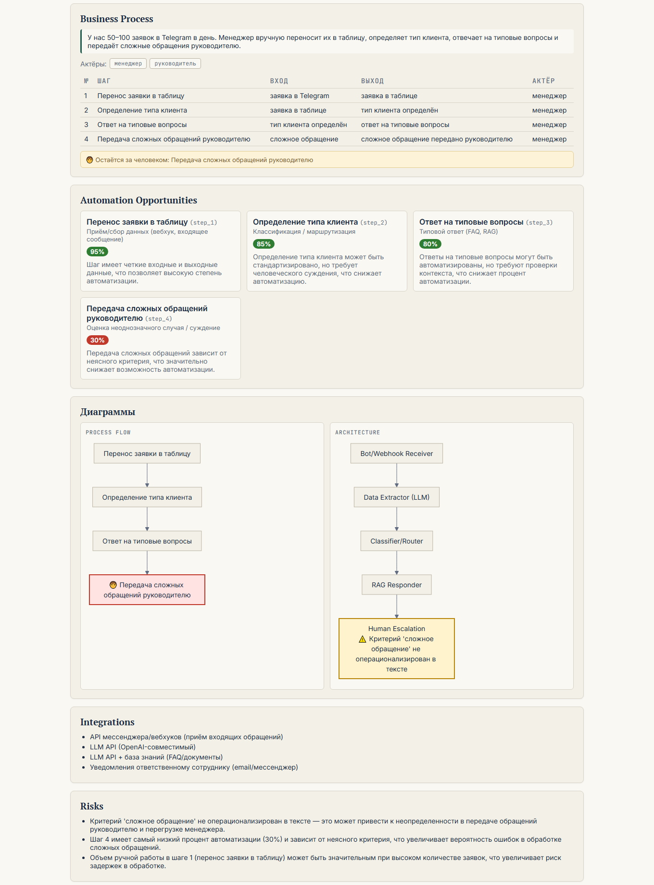
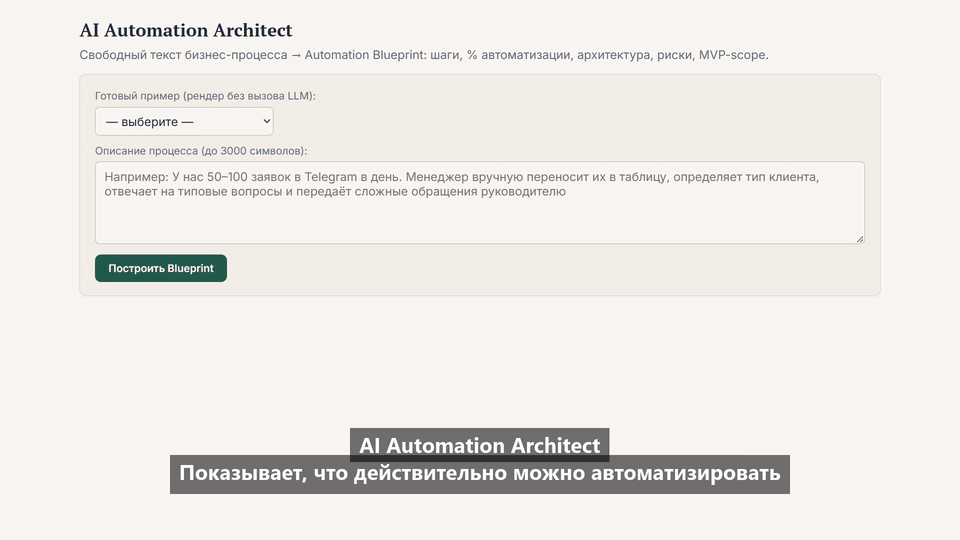

# AI Automation Architect

[](https://github.com/KirillTomenko/ai-automation-architect/actions/workflows/ci.yml)






## Demo

Посмотрите, как AI Automation Architect превращает описание бизнес-процесса обычным языком в Automation Blueprint: шаги, % автоматизации, архитектура, границы MVP.



Демо в полном разрешении (1080p): [MP4](docs/demo/ai-automation-architect-demo.mp4)

Описание бизнес-процесса обычным текстом → **Automation Blueprint** (JSON): карта процесса с актёрами и шагами, оценка автоматизируемости каждого шага, предлагаемая архитектура из типовых блоков, риски и MVP-scope.

Система принимает свободное описание — так, как процесс объяснил бы владелец бизнеса в двух-трёх предложениях (до 3000 символов), без формализованных схем. На выходе — структурированный документ: шаги с входами/выходами и исполнителями, процент автоматизации каждого шага, архитектура решения в виде графа из фиксированного каталога блоков, риски, MVP-scope и оценка трудозатрат по блокам, а также готовый текстовый отчёт по этапам — для показа клиенту без разбора JSON.

**Для кого:** собственники и операционные руководители малого/среднего B2B-бизнеса, у которого процессы идут через текст — сообщения, заявки, документы: продажи, поддержка, документооборот. Типовой вход — процесс, который живёт в переписке и «в голове», а не в BPMN-нотации.

**Честно о границах:** это не коннектор и не готовый бот — система делает первый шаг: переводит «у нас всё вручную» в предметную основу для решения. Что автоматизируется легко, что останется за человеком, из каких типовых блоков собирать MVP. Проценты автоматизации берутся из диапазонов фиксированной таксономии (модель их не придумывает), архитектура собирается только из каталога типовых блоков — поэтому оценки сопоставимы между разными кейсами. Каждый выход стадии валидируется Pydantic-схемой; невалидный JSON — retry, а не «починить руками».

## Пример

Вход (`examples/raw/example_1.txt`):

> У нас 50–100 заявок в Telegram в день. Менеджер вручную переносит их в таблицу, определяет тип клиента, отвечает на типовые вопросы и передаёт сложные обращения руководителю.

Выход — фрагмент полного Blueprint (полный файл: `examples/blueprints/example_1.json`; шаги: 1 «Перенос заявки в таблицу», 2 «Определение типа клиента», 3 «Ответ на типовые вопросы», 4 «Передача сложных обращений руководителю»):

```json
{
  "automation_candidates": [
    {"step_id": "step_1", "category": "data_intake", "automation_pct": 95,
     "reasoning": "Шаг имеет четкие входные и выходные данные, что позволяет высокую степень автоматизации."},
    {"step_id": "step_2", "category": "classification_routing", "automation_pct": 85,
     "reasoning": "Определение типа клиента может быть стандартизировано, но требует человеческого суждения, что снижает автоматизацию."},
    {"step_id": "step_4", "category": "ambiguous_judgment", "automation_pct": 30,
     "reasoning": "Передача сложных обращений зависит от неясного критерия, что значительно снижает возможность автоматизации."}
  ],
  "risks": [
    "Критерий 'сложное обращение' не операционализирован в тексте — это может привести к неопределенности в передаче обращений руководителю и перегрузке менеджера."
  ],
  "mvp_scope": {
    "in":  ["Bot/Webhook Receiver", "Data Extractor (LLM)", "Classifier/Router", "RAG Responder"],
    "out": ["Human Escalation"]
  }
}
```

Шаг с самым низким процентом (30%) попадает в `human_in_the_loop`: на диаграмме он помечается 🧑, а в архитектуре уходит в блок Human Escalation — система сама показывает, где автоматизация упирается в человека.

Восемь готовых кейсов разных типов бизнеса — Telegram-заявки, запись на услуги, обработка заказов e-commerce, HR-онбординг, логистика, претензия на возврат, юридическая консультация и обезличенный вариант коммуникационного процесса — доступны без вызова LLM в выпадающем списке фронтенда (`examples/blueprints/`).

## Как это работает

Пайплайн из 4 последовательных LLM-стадий, каждая с отдельным промптом и своей валидацией:

1. **Process Extractor** — извлекает актёров, точку входа и шаги (вход/выход/исполнитель) строго из текста. Если что-то не названо — помечает как пробел (assumptions, placeholder «не указано в тексте»), а не додумывает шаги.
2. **Classifier** — классифицирует каждый шаг по фиксированной таксономии из `config/taxonomy.yaml` (8 категорий, от «приём данных» 95–100% до «решение с юридическими/финансовыми последствиями» 0–20%). Процент берётся из диапазона категории, а не подбирается моделью.
3. **Architecture Composer** — собирает архитектуру только из блоков каталога `config/block_catalog.yaml` (Bot/Webhook Receiver, Data Extractor (LLM), Classifier/Router, RAG Responder, Generator (LLM), Rules Engine, CRM Connector, Notifier, Human Escalation) и возвращает граф `nodes` + `edges`. Новые типы блоков не изобретаются.
4. **Packager** — собирает выходы стадий 1–3 в финальный JSON и добавляет advisory-часть (risks, mvp_scope, estimated_effort) — это рекомендации, а не факты.

Дополнительно из готового Blueprint детерминированно (без нового LLM-вызова) генерируется текстовый отчёт по этапам — для показа заказчику, не только для разработчика.

Таксономия и каталог — редактируемые YAML-конфиги, промпты их подставляют, а не дублируют. Stage 1 работает на пониженной температуре (`LLM_TEMPERATURE_STAGE1`) — извлечение и классификация пробелов должны быть воспроизводимыми; Stage 2–4 работают на базовой (`LLM_TEMPERATURE`) — разнообразие формулировок в классификации и рекомендациях не мешает, а для advisory-части (risks, mvp_scope) даже полезно. Вход и выход каждой стадии логируются отдельно — пайплайн отлаживается по стадиям, а не «всё сразу».

## Known Limitations

- **Неявное ветвление не детектируется**, если оно не выражено явным условием в тексте. «Определение типа клиента» без описанных исходов классифицируется как линейный шаг. На практике критерии эскалации/сложности в таких описаниях обычно явные («если что-то сложное — руководителю») и детектируются корректно.
- **Домены:** лучше всего работает на информационных/коммуникационных процессах — заявки, поддержка, документооборот. Для производственных и физических операций система показывает только информационный слой вокруг них (приём заявок, статусы, уведомления), сам физический процесс она не моделирует.
- **Характер выхода:** Blueprint — оценочная основа для разговора с разработчиком, а не техзадание и не работающая автоматизация. Проценты — ориентиры из таксономии, не замеры.
- **При исчерпании баланса ProxyAPI** сервис отвечает 503 с понятным сообщением, а не общей внутренней ошибкой — это ожидаемое поведение демо-режима, не баг.

## Планы по развитию

- **Генерация технического задания (v2)** — сейчас Blueprint даёт архитектуру и оценку автоматизации; следующий шаг — на этой основе генерировать конкретные API endpoints, модели данных и тестовые сценарии как отдельный модуль поверх готового Blueprint.
- **Детекция неявного ветвления** — сейчас Stage 1 распознаёт только явно выраженные в тексте условия перехода («если сложное — руководителю»); расширение на неявную логику ветвления («в зависимости от типа клиента») потребует нового поля в схеме и отдельной валидации.
- **Расширенный branching-граф на диаграмме процесса** — сейчас process flow рисуется линейно с выделением человеческих шагов; полноценный граф с ветвлениями по условиям — отдельная задача, требует данных, которых пока нет в схеме Stage 1.
- **Внешнее хранилище для rate-limiter** — сейчас лимит запросов и счётчики стадий держатся в памяти одного процесса; при масштабировании на несколько воркеров понадобится вынести это в Redis или аналог.

## Запуск

```bash
pip install -r requirements.txt
copy .env.example .env    # затем заполнить ключи
python -m uvicorn app.main:app --port 8000
```

Фронтенд: **http://localhost:8000/** — форма ввода и выпадающий список из 8 готовых кейсов разных типов бизнеса — Telegram-заявки, запись на услуги, e-commerce, HR-онбординг, логистика, претензия на возврат, юридическая консультация и обезличенный вариант коммуникационного процесса (рендерятся без вызова LLM). «Построить Blueprint» — живой прогон через 4 стадии, обычно 20–60 секунд. Программный доступ: `POST /blueprint` с телом `{"description": "..."}`. Текстовый отчёт: `POST /report` с телом готового blueprint'а (такой же JSON отдают `POST /blueprint` и `GET /examples/{name}`) — ответ `{"report": "..."}`, детерминированная сборка без LLM.

Настройка `.env` (шаблон — `.env.example`):

| Переменная | Зачем |
|---|---|
| `PROXYAPI_BASE_URL` | OpenAI-совместимый base URL ProxyAPI |
| `LLM_API_KEY` | ключ ProxyAPI |
| `LLM_MODEL` | базовая модель для стадий 2–4 (например, `gpt-4o-mini`) |
| `LLM_MODEL_STAGE1` | **задавайте обязательно**: отдельная (более сильная) модель для Stage 1, например `gpt-4.1`. Без неё Stage 1 откатывается на `LLM_MODEL` и менее стабилен в семантической детекции — канал входа, исполнители, критерии ветвления. Дороже базовой, но Stage 1 — смысловая интерпретация текста, на ней держится весь пайплайн |
| `LLM_TEMPERATURE_STAGE1` | **задавайте обязательно**: пониженная температура Stage 1 (`0.1`). Дефолт в коде совпадает, но фиксируйте значение явно — устойчивость извлечения важнее экономии переменной |
| `LLM_TEMPERATURE` | базовая температура стадий 2–4 (по умолчанию `0.3`) |
| `LLM_TIMEOUT_S` | таймаут вызова LLM (по умолчанию `45`) |
| `LLM_MAX_TOKENS` | лимит токенов ответа (по умолчанию `3000`) |

Тесты: `pytest` — по стадиям пайплайна, e2e через HTTP и рендер диаграмм.

## Deploy (Docker на VPS)

В репозитории: `Dockerfile` (python:3.12-slim, непривилегированный пользователь) и `docker-compose.yml` (один сервис, `restart: unless-stopped`).

1. Клонировать репозиторий на VPS и создать `.env` **рядом с compose-файлом** — состав переменных см. в таблице раздела «Запуск»; обязательны `PROXYAPI_BASE_URL`, `LLM_API_KEY`, `LLM_MODEL`, `LLM_MODEL_STAGE1`, `LLM_TEMPERATURE_STAGE1`. В репозиторий и в образ `.env` не попадает (`.gitignore` + `.dockerignore`).
2. Если порт 8000 на хосте занят — добавить в `.env` строку `APP_PORT=8000` (или другой), снаружи будет он; внутри контейнера всегда 8000.
3. Запуск и обновление:

```bash
docker compose up -d --build
```

4. Проверка: `curl http://localhost:8000/` (страница) и `curl http://localhost:8000/config/taxonomy` (конфиг отдаётся — приложение живо).

Примечания:

- **Порт 80/443:** контейнер публикует только `APP_PORT`; TLS/домен закрывает nginx (или аналогичный reverse-proxy) перед compose-сервисом. Rate-limiter читает реальный IP клиента из `X-Forwarded-For` — при такой схеме лимит «5 запросов/сутки» работает корректно.
- **Один воркер:** rate-limit и счётчики стадий — in-memory, рассчитаны на один процесс uvicorn. Не масштабируйте `--workers`/репликами, пока лимитер не вынесен во внешнее хранилище.
- Секреты нигде не хардкодятся: контейнер получает окружение через `env_file: .env`; `.env` в git не коммитится и в образ не копируется.
